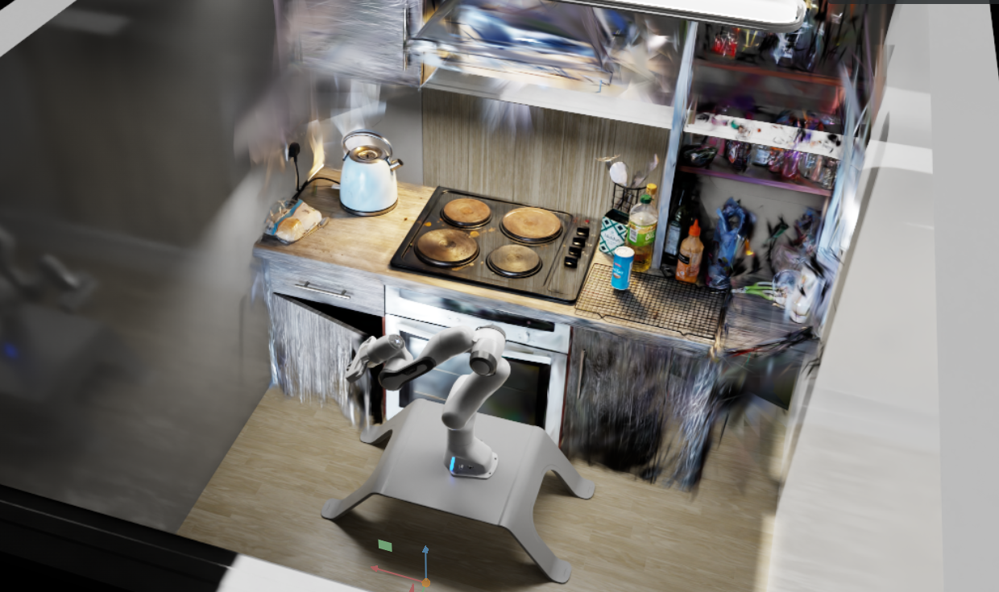
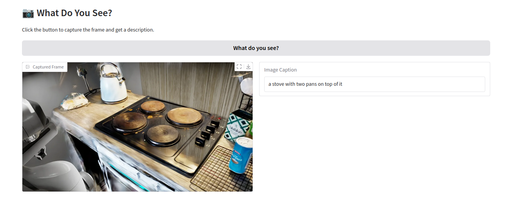

# IsaacsKitchen

This project includes a robot and a kitchen scene built in Isaac Sim, using a Gaussian splatter of my kitchen to create realistic visual effects.

What’s included?

    A robot model set up to interact within a kitchen environment.

    A kitchen scene rendered with Gaussian splatter techniques for enhanced realism.

    Simulated ROS based camera

    Options to customize lighting, robot settings, and other scene elements.

    Basic ROS2 package demonstrating VLM capability to recognize splatter scene.

What can you do with this?

    Develop and test robot manipulation tasks, like picking up objects or moving around the kitchen.

    Experiment with robot perception and VLM based task segmentation.

    Work on navigation and path planning in a realistic indoor environment.

Advanced Next Steps?

    Integrate with FoundationPose to manipulate imported objects within the environment

    Use Visual Servoing to avoid collisions with the imported splatter

    Test Visual Reasoning of different models with image stream from the kitchen scene

## Requirements

ROS Humble
Ubuntu 22.04 (tested)
Isaac-sim 5.0.0  (tested)

Tested using a Nvidia 5070 GPU with CUDA 12.8

## Installation
For Isaac-sim
    1. clone repository
    2. Launch Isaac sim and open kitchen_robot/dev_scene.usdz
    3. Run simulation, Camera will stream Image data to /rgb topic

For ROS package
    cd kitchen_ros
    python3.10 -m venv venv
    source venv/bin/activate
    pip install --upgrade pip
    pip install -r requirements.txt

    pip install 'numpy<2.0' #optional

    cd kitchen_ros
    colcon build --symlink-install #this may flag dependacy issues with Numpy, package is still basic but serves as a poc
    source install/setup.bash
    ros2 launch image_llm_interface Ask_llm.launch.py

To view the VLM caption of the image, enter the local adress specified in kitchen_ros/src/LLM/scripts/ask_with_image_gui.py line 58, you may have to change this depending of which ports are availible.

## Output

